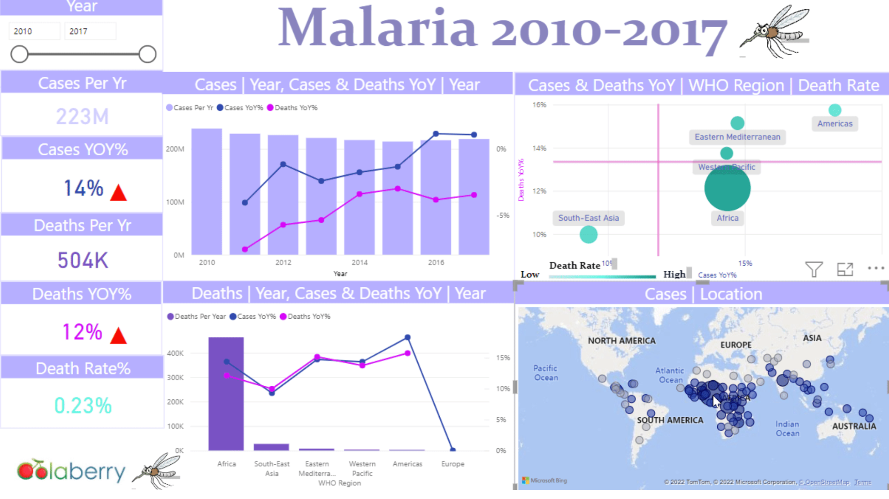
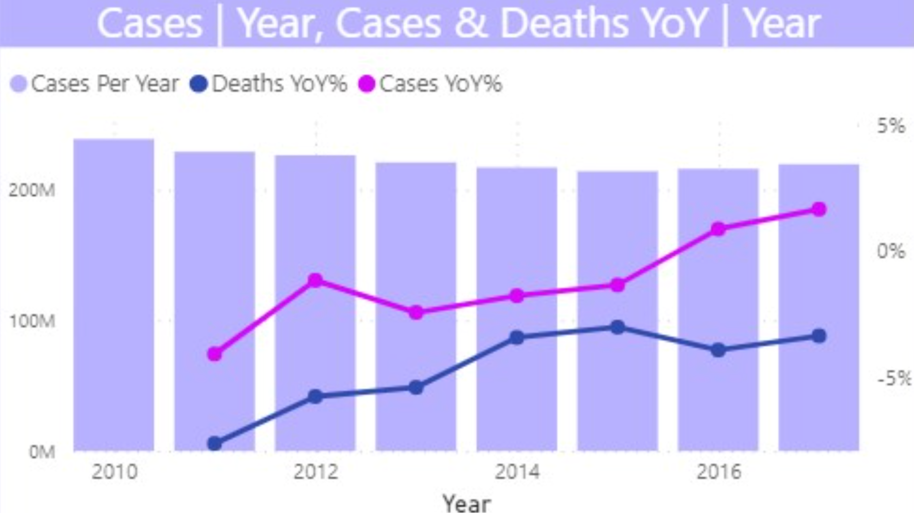
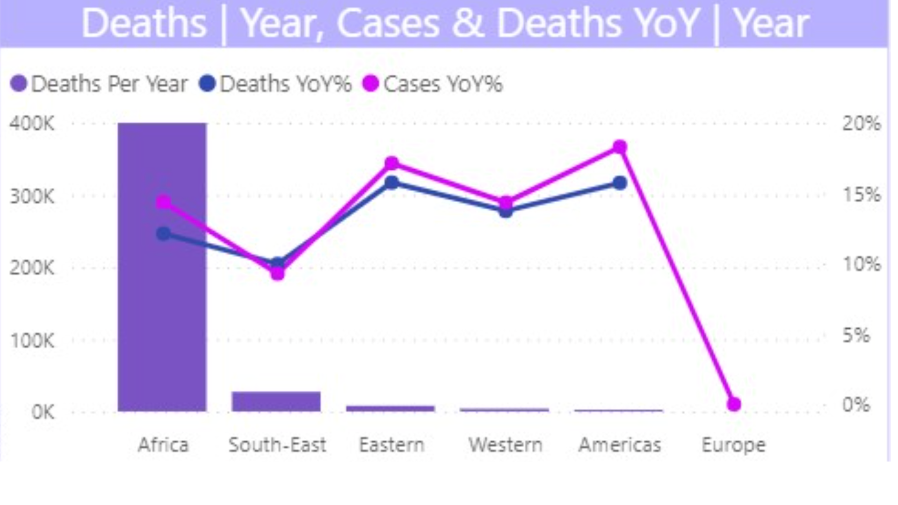
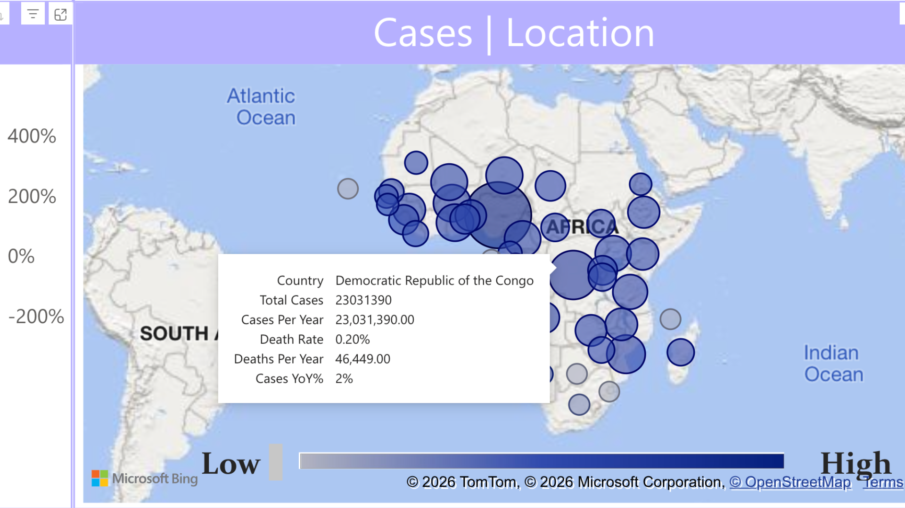
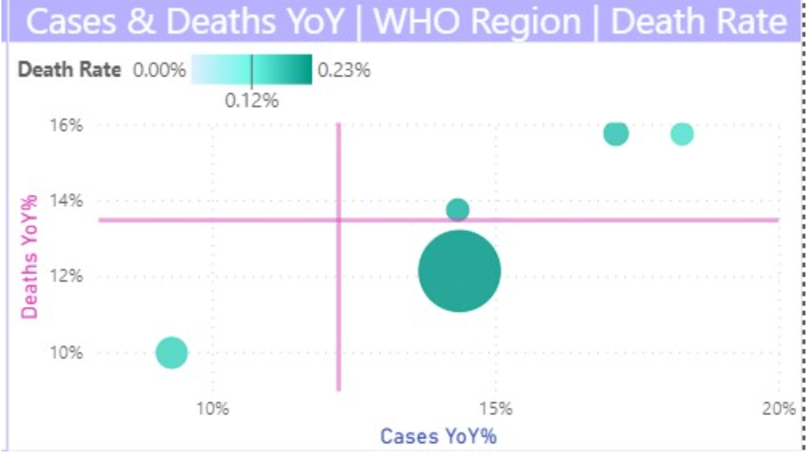

# Global Malaria Trends Dashboard

An interactive Power BI dashboard analyzing global malaria trends from 2010–2017 to evaluate progress toward the WHO 2030 malaria elimination goal.

## 🌐 Live Interactive Dashboard

Explore the fully interactive Power BI dashboard.

**▶ [Launch Dashboard](https://app.powerbi.com/view?r=eyJrIjoiNjY2MmRhMGUtZDJjNC00OGFkLTgzMGQtOGQ2MTE0MThlNGE0IiwidCI6IjFmNTE4YTA5LTA2ZDAtNGFmYi05YTFjLWRmZDA4NjFmNWVlNiJ9)**

## Project Overview

This end-to-end business intelligence case study analyzes WHO malaria case and mortality data to evaluate progress toward the WHO 2030 malaria elimination goal. The project demonstrates the complete analytics lifecycle—from data preparation and modeling to interactive dashboard development and executive recommendations supporting data-driven public health decision-making.

## Business Impact

This dashboard transforms complex WHO malaria data into executive-ready insights that help decision-makers:

- Monitor progress toward WHO malaria elimination targets
- Identify high-burden regions requiring intervention
- Compare year-over-year performance
- Support evidence-based public health resource allocation

## Key Questions

- Are malaria cases and deaths declining fast enough to support the WHO 2030 elimination goal?
- Which WHO regions carry the highest malaria burden?
- Where are cases or deaths increasing year-over-year?
- How can data support better resource allocation?

## Tools Used

- Power BI
- SQL
- Excel
- Power Query
- DAX
- GitHub

## Key Deliverables

- Interactive Power BI dashboard
- Executive case study presentation
- Data cleaning workflow
- DAX measures
- Strategic recommendations

 ## Case Study Presentation

View the complete consulting-style project presentation:

**[Open the Global Malaria Trends Case Study](presentation/Global_Malaria_Trends_Case_Study.pdf)**

 ## Dataset

The dataset was sourced from Kaggle and contains malaria case and death records by country, year, and WHO region.

Dataset: [Malaria Dataset by imdevskp](https://www.kaggle.com/datasets/imdevskp/malaria-dataset)

## Data Preparation

The data preparation process included:

- Removing duplicate records in Excel
- Validating country, year, case, and death fields
- Cleaning and standardizing data using SQL
- Transforming data types in Power Query
- Replacing null values where appropriate
- Formatting year fields correctly for time-based analysis

## Dashboard Features

- KPI cards for cases, deaths, YoY growth, and death rate
- Year slicer for dynamic filtering
- Trend analysis by year
- WHO regional comparison
- Geographic map with country-level tooltips
- Bubble chart analyzing cases YoY, deaths YoY, and death rate

## Skills Demonstrated

- Business Intelligence
- Data Cleaning
- SQL
- Power Query (ETL)
- DAX
- Dashboard Design
- KPI Development
- Data Visualization
- Data Storytelling
- Executive Reporting
  
 ## Key Insights

Analysis of WHO malaria data (2010–2017) revealed several important findings:

- Global malaria mortality continued to decline throughout the study period.
- Malaria cases and deaths remained heavily concentrated in a small number of high-burden WHO regions.
- Regional disparities suggest targeted interventions are needed to achieve the WHO 2030 malaria elimination goal.
- Interactive filtering enables executives to compare trends across years, regions, and countries.
- Geographic visualization helps identify disease hotspots for resource prioritization.
  
  
## Dashboard Preview

Below are selected views from the interactive Power BI dashboard. For the full interactive experience, click **Launch Dashboard** above.

### Executive Dashboard

The complete executive dashboard combines KPI monitoring, trend analysis, regional comparisons, geospatial intelligence, and interactive filtering into a single decision-support tool.

---

### Trend Analysis

Analyze annual malaria case trends alongside year-over-year changes in cases and deaths from 2010–2017 to evaluate overall progress toward the WHO 2030 malaria elimination goal.

---

### WHO Regional Comparison

Compare malaria deaths and year-over-year performance across WHO regions to identify high-burden areas and regional disparities requiring targeted intervention.

---

### Geographic Intelligence

Explore the geographic distribution of malaria cases through an interactive map with country-level tooltips, bubble sizing by case volume, and color intensity representing death rate.

---

### Correlation Analysis

Analyze the relationship between year-over-year case growth, death growth, and mortality rate using an interactive bubble chart. Bubble size represents disease burden, while color intensity reflects death rate, helping identify high-risk regions and emerging hotspots.

